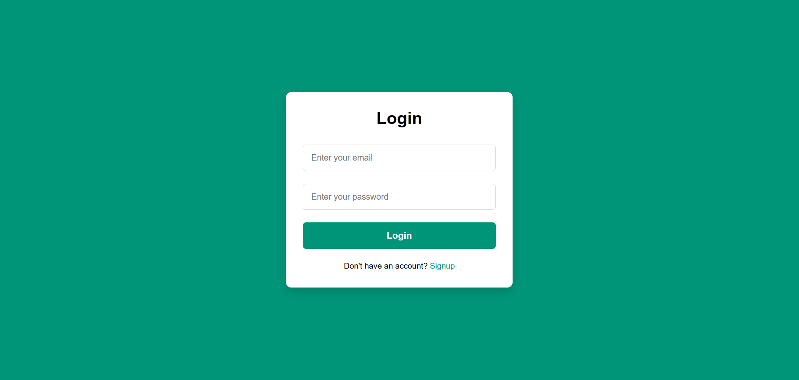
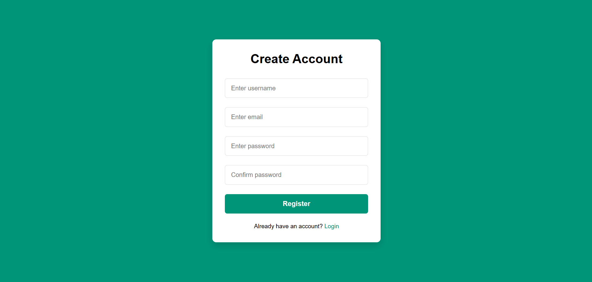
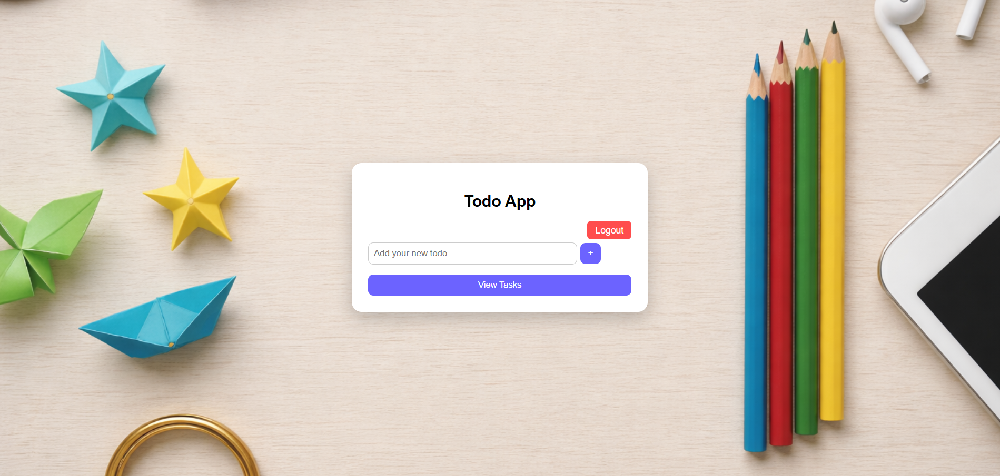
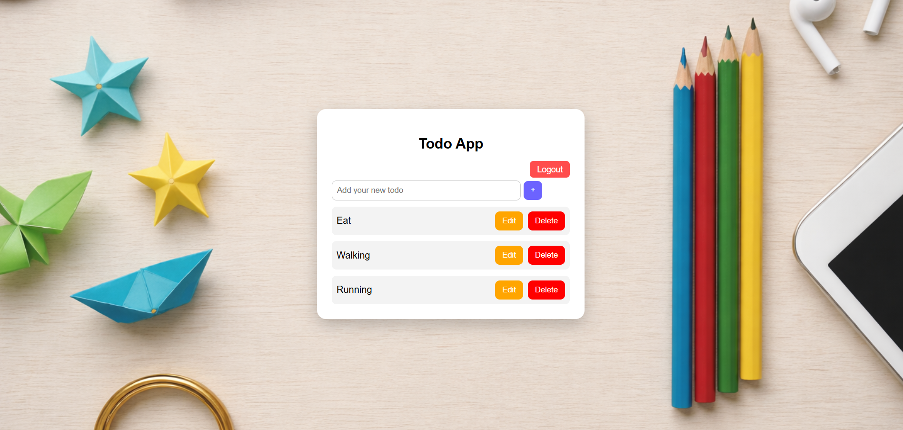

# django-todo-app
A web-based ToDo List application built using Django that allows users to register, log in, and manage their daily tasks securely.

## Features
- User Registration
- User Login & Logout (Authentication)
- Add new tasks
- Update existing tasks
- Delete tasks
- Each user manages their own tasks (data isolation)
- Simple and user-friendly UI

## Tech Stack
- Python
- Django
- HTML
- CSS
- MYSQL

## How to Run the Project

1. Clone the repository:
git clone https://github.com/NithinChowdary123-Virat/django-todo-app.git

2. Navigate to the folder:
cd django-todo-app

3. Create virtual environment:
python -m venv venv

4. Activate it:
venv\Scripts\activate

5. Install dependencies:
pip install -r requirements.txt

6. Run server:
python manage.py runserver

## Screenshots

### Login Page

### Registration Page

### Dashboard

### View Task

## Future Improvements
- Add task categories
- Password reset functionality
- Task deadlines & reminders
- Search and filter tasks
- Deploy on cloud (AWS / Render/ Azure)

## Author
Nithin Chowdary
